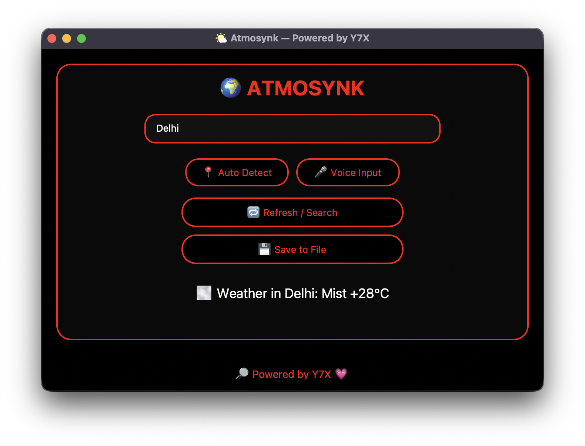

<h1 align="center">🌩️ ATMOSYNK — Weather Pro Max</h1>

<p align="center">
  
  
  
</p>

<div align="center">
  
</div>

---

## 🧠 What is Atmosynk?

> **Atmosynk** is your minimal, **real-time weather app**, built in Python using `customtkinter`, with:
- 📍 **Auto location detection**
- 🎤 **Voice input**
- 🌫️ **Emoji-powered weather updates**
- 🔴 AMOLED UI with **red glow effects**
- 💾 Weather history saver
- 🔎 Branded with 💗 by **Y7X**

---

## 🚀 Features

| Feature                | Description                                             |
|------------------------|---------------------------------------------------------|
| 📍 Auto Detect City     | Fetches weather using your IP and `wttr.in`            |
| 🎤 Voice Input          | Speak your city name directly into the app             |
| 🌩️ Emoji Weather        | Weather displayed with accurate visual icons           |
| 🖤 AMOLED + RedX UI     | Fully dark theme with red-outlined buttons             |
| 💾 Save History         | Export all checked weather logs into a `.txt` file     |
| 🔎 Powered by Y7X 💗     | Always branded. Always premium.                       |

---

## 📦 Setup Instructions

> Works on macOS, Windows, and Linux (Python 3.8+)

### 🔧 Install Dependencies

```bash
pip install -r requirements.txt